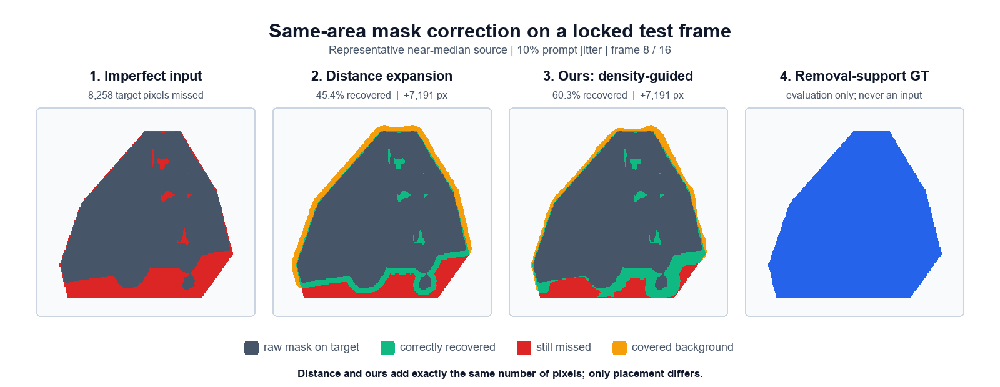

# Budget-Density Temporal Mask Correction for Video Object Removal



> **같은 `7,191`픽셀을 추가해도 누락 복구율은 기존 거리 확장 `45.4%`,
> 제안 방식 `60.3%`입니다.** 빨강은 아직 놓친 대상, 초록은 정확히 복구한
> 영역, 주황은 불필요하게 덮은 배경입니다.

이 저장소는 불완전한 video object removal mask에서 **얼마나 확장할지**와
**어디를 확장할지**를 함께 학습하고, 마스크 면적을 통제한 상태에서 실제
인페인팅 효과까지 검증하는 연구 프로젝트입니다.

> 최신 Experiment 15에서 120,050-parameter density head를 35개 source의
> 5-fold OOF로 선택하고, 모델을 잠근 뒤 30개 sealed source를 한 번
> 평가했습니다. 같은 예측 면적의 distance frontier보다 mask recovery가
> `+0.1020` 높았고, downstream masked PSNR은 ProPainter `+1.205 dB`,
> E2FGVI-HQ `+1.101 dB` 향상됐습니다. 두 backend 모두 사전등록 gate를
> 통과했습니다. 후속 35-source OOF ablation에서는 scalar/ordinal이 아니라
> **per-pixel density로 budget을 만드는 formulation만 완전히 지지**됐고,
> distance 혼합·connected decoder·고정 temporal smoothing의 독립 기여는
> 확인되지 않았습니다.

쉬운 설명은 [교수님 설명용 연구 요약](docs/PROFESSOR_BRIEF.md), 전체 흐름은
[연구 흐름과 근거 맵](docs/RESEARCH_FLOW.md), 최신 수치와 실패 분석은
[Experiment 15 결과](reports/learned_budget_density_cv/RESULTS.md)에 있습니다.

## 기존 확장과 제안 방식의 차이

빨강은 아직 mask가 놓친 제거 대상, 초록은 새로 정확히 복구한 영역, 주황은
불필요하게 덮은 배경입니다. 위 실제 locked-test 예시에서 기존 거리 확장과
제안 방식은 모두 정확히 `7,191`픽셀을 추가합니다. 그러나 거리 확장은 누락
영역의 `45.4%`, 제안 방식은 `60.3%`를 복구했습니다. 따라서 차이는 mask를
더 크게 만든 효과가 아니라 **같은 면적을 어디에 배치했는가**에서 옵니다.

이 그림은 30-source downstream gain의 중앙값 부근 source에서 고른 한 프레임
설명 예시이며 평균 결과를 뜻하지 않습니다. 전체 30-source 결과는 아래 표와
[Experiment 15 결과](reports/learned_budget_density_cv/RESULTS.md)에 별도로
보고합니다. 원본 RGB를 재배포하지 않고 고정된 binary mask 산출물만으로
[재생성](scripts/make_readme_mask_figure.py)할 수 있습니다.

## 연구 질문

> 불완전한 제거 마스크에서 관측 가능한 RGB, mask geometry, temporal
> evidence만으로 장면별 correction budget과 추가할 support 위치를 함께
> 예측할 수 있는가?

## 핵심 아이디어

방법별 마스크 크기가 다르면 “좋은 픽셀을 찾은 효과”와 “그냥 더 많이 가린
효과”가 섞입니다. 그래서 모든 공간 비교에서 매 프레임 같은 수의 픽셀을
추가합니다.

```text
RGB + raw mask + distance + frozen bidirectional SAM2 evidence
                              |
                              v
                  per-pixel residual density
                        /             \
             sum -> added budget      rank -> pixel placement
                        \             /
          connectivity-aware exact-budget correction mask
```

최종 rule은 learned rank와 distance rank를 1:1로 결합합니다. 기준선은
모델이 예측한 것과 **정확히 같은 추가 면적**을 사용하는 distance frontier라서,
결과가 단순 mask-size 증가로 설명되지 않습니다.

## 연구 흐름

1. **Boundary under-coverage 정의** — segmentation mask가 제거에 필요한
   support를 덜 덮는 현상을 clean-background GT로 정량화했습니다.
2. **Exact-area protocol** — 매 프레임 같은 픽셀 수를 추가하는 평가로
   budget 효과와 placement 효과를 분리했습니다.
3. **Temporal signal 검증** — 일반 단서보다 bidirectional SAM2 video
   evidence가 Synthetic, DAVIS, Cutie 결함에서 안정적으로 남았습니다.
4. **Fixed-budget 한계 확인** — 통제된 30영상에서 training-free downstream
   효과는 작았고, 1x oracle도 학습 GO 기준에 못 미쳤습니다.
5. **Variable-budget headroom** — 1.5x·2x·adaptive oracle에서 큰 상한을
   확인하고, same-area distance control로 위치 효과도 분리했습니다.
6. **Experiment 14 validation stop** — learned spatial rank는 유망했지만
   pooled scalar budget log-MAE `0.5599`로 gate를 실패해 test를 열지
   않았습니다.
7. **Experiment 15 density formulation** — 픽셀 density의 합으로 budget을
   얻도록 바꿔 5-fold OOF log-MAE `0.3300`을 달성했습니다.
8. **Locked test와 downstream GO** — 30-source mask test와 두 inpainting
   backend의 사전등록 gate를 모두 통과했습니다.
9. **Failure audit** — 공통 실패 1건과 약 +14-dB 성공 outlier를 확인하고,
   outlier 제거 후에도 결론이 유지되는지 검증했습니다.
10. **Component ablation** — test를 선택에 재사용하지 않고 35-source OOF에서
    8개 variant를 비교해 density budget만 핵심 component로 지지했습니다.

## Experiment 15 핵심 결과

### 5-fold OOF

| 평가 | 결과 |
|---|---:|
| Density budget log-MAE | **0.3300** |
| Density budget Spearman | **0.6919** |
| Recovery vs exact-area distance | **+0.0754** |
| Recovery 95% CI | **[+0.0634,+0.0870]** |
| Source wins | **35/35** |

### Sealed 30-source test

| 평가 | 결과 |
|---|---:|
| Budget log-MAE | **0.3509** |
| Recovery vs exact-area distance | **+0.1020** |
| Recovery 95% CI | **[+0.0830,+0.1215]** |
| Source wins | **29/30** |
| Added-precision delta | **+0.1020** |

### Downstream

| Backend | Masked-PSNR delta | 95% CI | Wins | Gate |
|---|---:|---:|---:|---|
| **ProPainter** | **+1.205 dB** | **[+0.400,+2.335]** | **26/30** | PASS |
| **E2FGVI-HQ** | **+1.101 dB** | **[+0.339,+2.215]** | **23/30** | PASS |

두 backend 모두 masked MAE와 outside-GT MAE도 감소했습니다.

### Component ablation

| Component | 결과 |
|---|---|
| Density vs scalar/ordinal budget | **SUPPORTED** |
| Absolute/temporal 입력의 공동 budget+spatial 기여 | NOT_SUPPORTED; budget 기여는 양성 |
| 0.5 distance prior | NOT_SUPPORTED |
| Connected decoder in selected hybrid | NOT_SUPPORTED |
| Fixed temporal budget smoothing | NOT_SUPPORTED |

전체 1,920 OOF frame × 8 variant에서 exact-budget mismatch는 0개였습니다.

## 결과를 과장하지 않기 위한 점검

- 가장 큰 성공 source를 빼도 평균은 ProPainter `+0.753 dB`,
  E2FGVI-HQ `+0.632 dB`이고 두 bootstrap CI 하한이 모두 양수입니다.
- ProPainter는 4/30, E2FGVI-HQ는 7/30 source에서 손해를 봤습니다.
- 두 backend가 함께 실패한 source는 1개입니다. 여기서는 recovery가
  좋아졌지만 복원기가 큰 잘못된 색 영역을 만들어 PSNR이 하락했습니다.
- 따라서 support recovery만으로 모든 inpainting utility를 설명하지 않습니다.

## 현재 판정

- **완료된 주장:** source-disjoint 학습, model lock, sealed synthetic test,
  exact-area control, 두 downstream backend에서 검증된 method prototype
- **아직 필요한 것:** 최신 경쟁 baseline, 자연 imperfect mask/실영상 test,
  density·absolute temporal evidence·distance mixture·connectivity ablation
- **논문 방향:** 위 외부 gate까지 유지되면 applied method paper, 무너지면
  통제 실험과 실패 분석이 강한 연구 프로젝트

## 핵심 문서

- [교수님 설명용 연구 요약](docs/PROFESSOR_BRIEF.md)
- [연구 흐름과 근거 맵](docs/RESEARCH_FLOW.md)
- [Experiment 15 결과](reports/learned_budget_density_cv/RESULTS.md)
- [Experiment 15 사전등록](reports/learned_budget_density_cv/PREREGISTRATION.md)
- [Experiment 15 downstream 계획](reports/learned_budget_density_cv/DOWNSTREAM_PLAN.md)
- [Experiment 16 component ablation](reports/budget_density_component_ablation/RESULTS.md)
- [Experiment 14 실패 결과](reports/learned_budget_support_pilot/RESULTS.md)
- [Variable-budget oracle](reports/variable_budget_oracle_curve/RESULTS.md)
- [Same-area distance control](reports/same_budget_distance_control/RESULTS.md)
- [Single-component 30 복제](reports/single_component_confirmatory_30/RESULTS.md)
- [재현 가이드](reproducibility/README.md)

## 저장소 구성

```text
configs/          고정된 실험 설정과 source split
docs/             연구 질문, 설명 흐름, 주장 범위
reports/          사전등록, compact metrics, 결과와 실패 분석
reproducibility/  환경과 재현 절차
scripts/          데이터 준비, 학습, mask 평가, downstream 분석
external/         외부 모델 저장소 복원 안내
```

대용량 프레임, 모델 출력, 체크포인트는
`D:/DCG-TR_experiment_results/experiments/15_learned_budget_density_cv`에
기존 실험과 분리해 보존합니다. Git에는 설정, 코드, compact metrics,
사전등록과 결과 요약만 남깁니다.

원본 데이터와 산출물 디렉터리 규칙은
[프로젝트 구조](PROJECT_STRUCTURE.md)에 정리했습니다.
